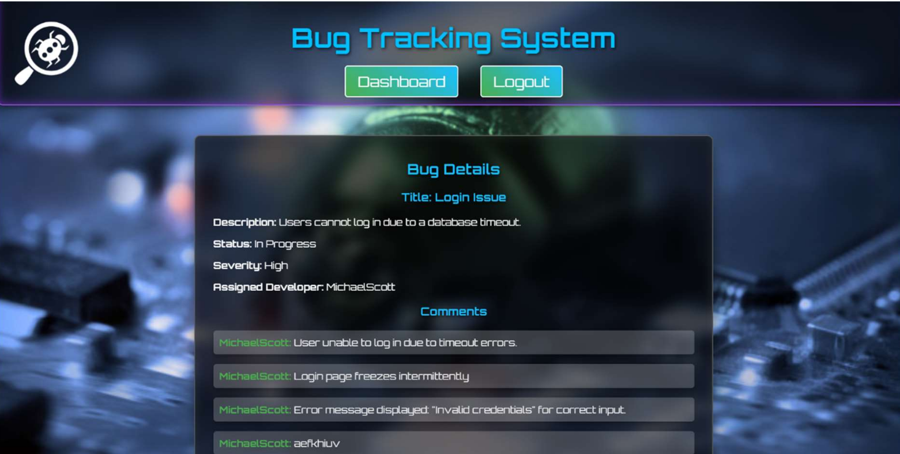
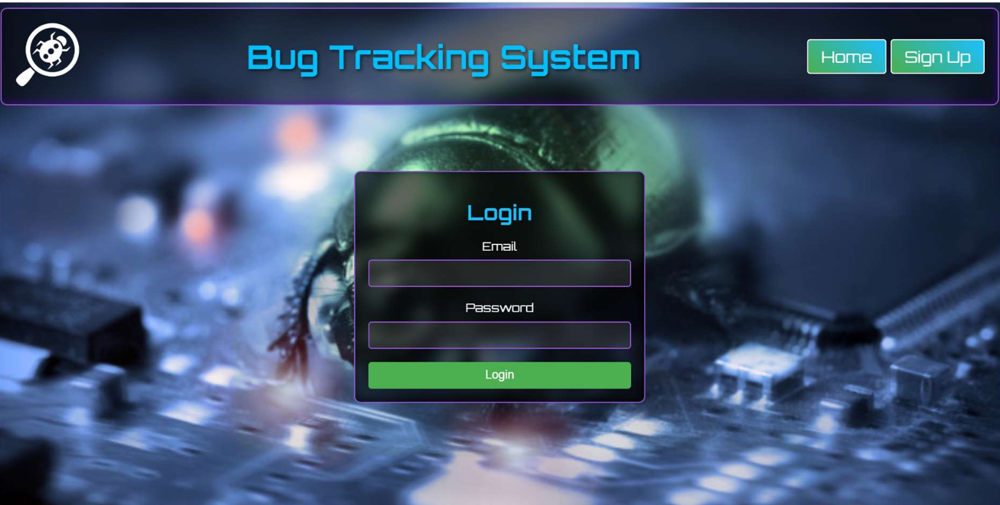
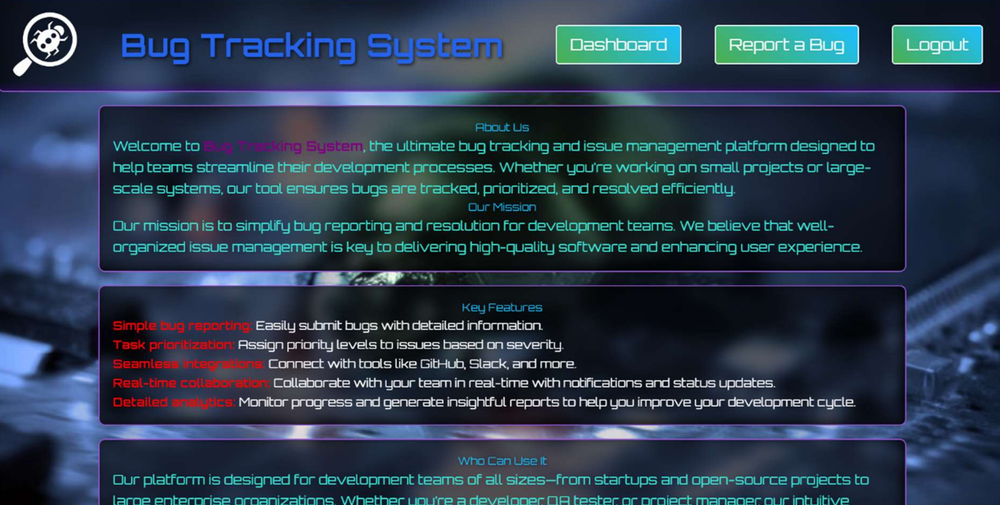
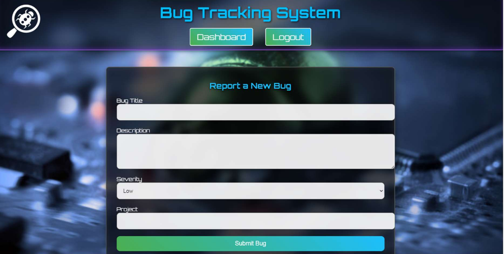
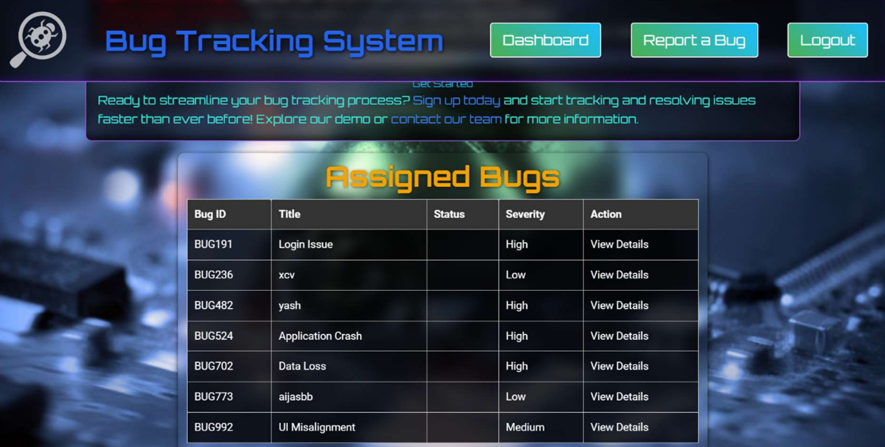
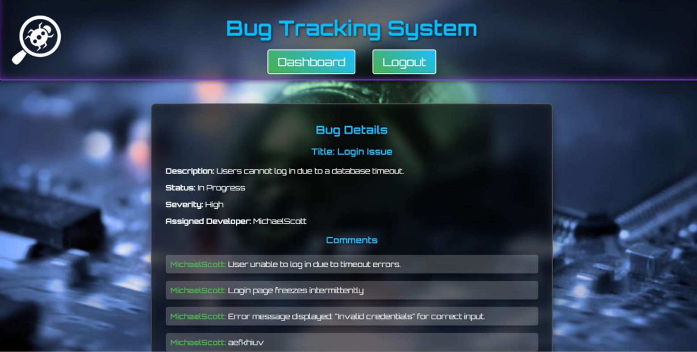

# 🛡️ BugTrackingSystem

A full-stack web application designed to report, track, and manage software bugs. This project follows the Model-View-Controller (MVC) architecture to ensure clean code and scalability.

## 📸 Screenshots

### Dashboard

### Bug Report Details

## 🚀 Features
* **User Authentication**: Secure Signup and Login functionality using `bcrypt` and JSON Web Tokens (JWT).
* **Task Management**: Full CRUD capabilities for bug reports, including the ability to add comments and submit reports.
* **Session Management**: Persistent user sessions with `express-session` and `cookie-parser`.
* **Flash Notifications**: Real-time user feedback using `connect-flash`.

## 🛠️ Tech Stack
* **Backend**: Node.js (v18.19.1) & Express.js.
* **Database**: MySQL (via `mysql2/promise`).
* **Frontend**: EJS (Embedded JavaScript templates).
* **Security**: `bcrypt` for password hashing and JWT for protected routes.
